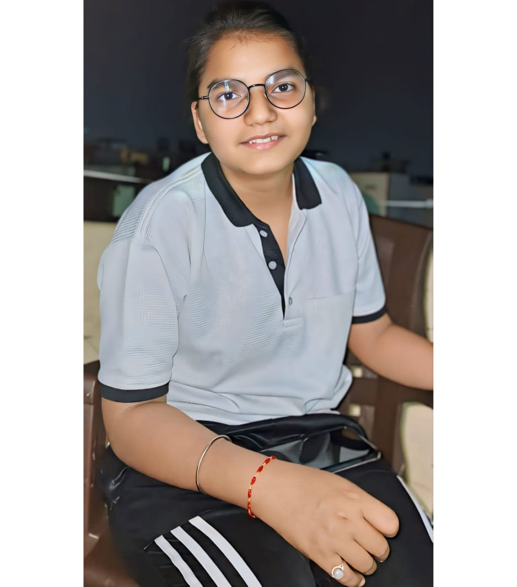

<!DOCTYPE html>
<html lang="en">
<head>
    <meta charset="UTF-8">
    <meta name="viewport" content="width=device-width, initial-scale=1.0">
    <title>Janhvi Singh - Developer Portfolio</title>
    <link rel="preconnect" href="https://fonts.googleapis.com">
    <link rel="preconnect" href="https://fonts.gstatic.com" crossorigin>
    <link href="https://fonts.googleapis.com/css2?family=Poppins:wght@400;600;700&display=swap" rel="stylesheet">
    
    
</head>
<body>
    <header>
        <nav>
            
Janhvi's Portfolio

            

                <ul>
                    <li><a href="/">Home</a></li>
                    <li><a href="/">About</a></li>
                    <li><a href="#services">Services</a></li>
                    <li><a href="/">Projects</a></li>
                    <li><a href="#contact">Contact Me</a></li>
                </ul>
            

        </nav>
    </header>
    <main>
        <section class="firstSection"> 
            

                Hi, my name is Janhvi Singh 
                
and I am a Passionate

                
                

                    <!-- Resume Download Button -->
                    <a href="janhvi.resume.jpg.pdf" target="_blank" download>
                        <button class="button">Download Resume</button>
                    </a>
                    <!-- GitHub Button -->
                    <a href="https://github.com/janhvis250"_blank">
                        <button class="button">Visit GitHub</button>
                    </a>
                

            

            

                
            

        </section>
        

        <section class="secondSection">
            <h1>About Me</h1>
            

                I'm currently a B.Tech 2nd year student at KAMLA NEHRU INSTITUTE OF PHYSICAL & SOCIAL SCIENCES  FARIDIPUR, SULTANPUR (U.P.)
                , specializing in CSE with AI. I am learning web development and have a strong understanding of C language, Java, python and MySQL.
            

        </section>
        <section id="services" class="secondSection">
            <h1>Services</h1>
            <ul>
                <li>Website development using HTML, CSS, JavaScript, Next.js, and Node.js</li>
                <li>Front-end and back-end web development</li>
                <li>Custom web solutions and design</li>
                <li>Java and Python programming solutions</li>
                <li>Database management using MySQL</li>
                <li>AI-related concepts and implementation</li>
            </ul>
        </section>
        

        <section class="secondSection">
            <h1>Projects</h1>
            
Currently, I Have Only one simple projects. It's based on real word problem;- Library Management System is one of the most common software development projects till date. In this article, we are going to make the Library Management System software development project, from scratch, for 2nd year students. We will be covering all the steps you have to do while developing this project.In Our project as we will be exploring about web application for Library Management system project so we will be required below skill sets. 

            
 1:- Front end Developer
                2:- Back end Developer 
                3:- Tester
                4:- Devops Developer 

        </section>
        
        

        <!-- New Contact Section -->
        <section class="contact-section">
            <h2>Interested? Contact Me!</h2>
            
If you're interested in working with me or have any inquiries, feel free to send me an email or give me a call!

            <a href="mailto:singhjanhvi2006@gmail.com">Send an Email</a> 
              
            <a href="tel:+91 9219435121">Call Me</a>
        </section>
        

        <section id="contact" class="secondSection">
            <h1>Contact Me</h1>
            
Email: <a href="mailto:singhjanhvi2006@gmail.com" style="color: white;">singhjanhvi2006@gmail.com</a>

            
Phone: <a href="tel:+919219435121" style="color: white;">+91 9219435121</a>

        </section>
    </main>
    <footer>
        

            

                <h1>janhvi's Portfolio</h1>
            

            

                <ul>
                    <li>Home</li>
                    <li>Contact</li>
                    <li>Projects</li>
                    <li>Services</li>
                </ul>
            

            

                <ul>
                    <li>Home</li>
                    <li>Contact</li>
                    <li>Projects</li>
                    <li>Services</li>
                </ul>
            

            

                <ul>
                    <li>Home</li>
                    <li>Contact</li>
                    <li>Projects</li>
                    <li>Services</li>
                </ul>
            

        

    </footer>

    
    
</body>
</html>
